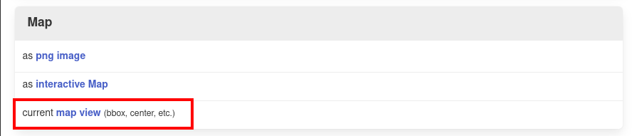
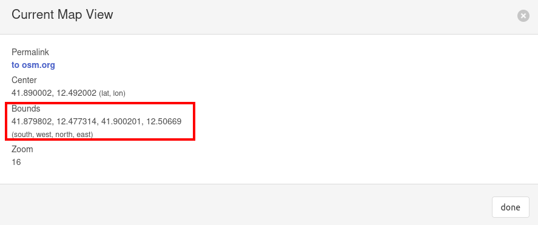
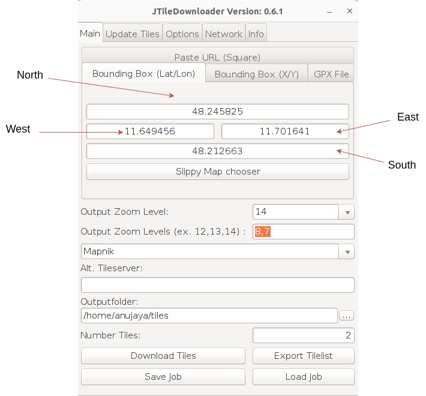

# Offline Map

## Bounding box and map details
In order to download information regarding roads, buildings etc. for a particular bounding box, go to https://overpass-turbo.eu/ and choose an appropriate bounding box. Then execute, for example, following query:

```
[out:xml][timeout:60];

(
  // Roads / streets
  way["highway"]({{bbox}});

  // Buildings
  way["building"]({{bbox}});

  // Parks / green areas
  way["leisure"="park"]({{bbox}});
  way["landuse"="grass"]({{bbox}});
  way["landuse"="forest"]({{bbox}});

  // Water
  way["waterway"]({{bbox}});
  way["natural"="water"]({{bbox}});

  // Railways
  way["railway"]({{bbox}});

);

out body;
>;
out skel qt;
```
Then go to "Export" and download the GeoJSON file. To get the coordinates of the bounding box, go to Export and click on "map view" under Map section which will open a popup with the title "Current Map View". There, under Bounds the coordinates of the bounding box can be found.






## Downloading Map Tiles
Install JtileDownloader with
```
sudo snap install jtiledownloader
```

Open JtileDownloader and enter the coordinates of the bounding box, zoom levels and the output folder and click on "Download Tiles. 




