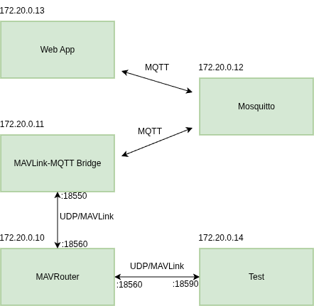

# Main Architecture 

There are 5 containers running altogether. MAVLink and the web app cannot communicate directly with each other. Therefore, MQTT is used as a workaround. 

MAVRouter has a common endpoint for incoming traffic with the port 18560 and it then distributes all the traffic towards two other endpoints in Test and MAVLink-MQTT containers.

## Custom MAVLink Library
Two messages were added to the standard MAVLink library with the following names and fields:

WAYPOINT_IN
uint16_t wp_id (waypoint id)
int32_t lat (latitute)
int32_t lat (longitude)

WAYPOINT_OUT
uint16_t wp_id (waypoint id)
int32_t lat (latitute)
int32_t lat (longitude)

When a waypoint is added in the web interface WAYPOINT_IN message is sent with a unique ID and coordinates. Similarly when a waypoint is removed, WAYPOINT_OUT is sent. When a waypoint is moved WAYPOINT_IN message with the ID of the waypoint that is being moved is sent. This can be tested by running mavlink_server program in the test container.

